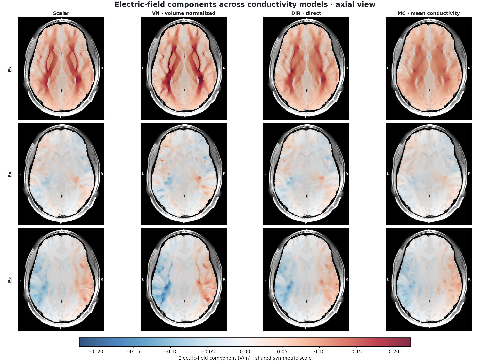
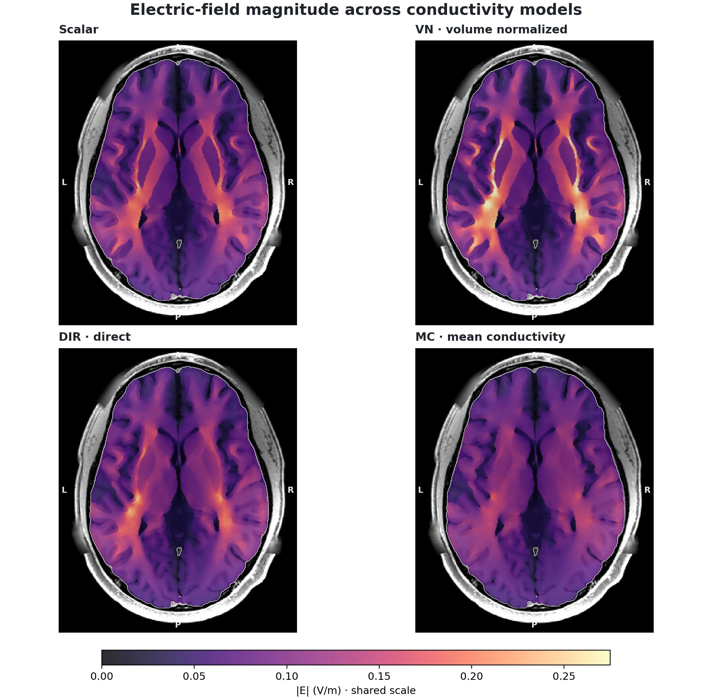

<div align="center">

# dwi2cond-xp

Cross-platform, FSL-free DTI-to-conductivity workflows for SimNIBS 4.6.

[](https://github.com/ayakacxy/dwi2cond-xp/releases/latest)
[](https://github.com/ayakacxy/dwi2cond-xp/actions/workflows/ci.yml)
[](https://github.com/ayakacxy/dwi2cond-xp/actions/workflows/codeql.yml)
[](https://scorecard.dev/viewer/?uri=github.com/ayakacxy/dwi2cond-xp)
[](#-validation-at-a-glance)
[](pyproject.toml)
[](docs/SIMNIBS_INTEGRATION.md)
[](LICENSE)

[简体中文](README.zh-CN.md) · [Documentation](docs/README.md) · [Validation](docs/VALIDATION.md) · [Roadmap](docs/ROADMAP.md) · [Release notes](docs/CHANGELOG.md)

🧠 **DTI fitting** · ⚡ **FSL-free runtime** · 🧭 **Tensor reorientation** · ⚡ **Anisotropic FEM** · 🧪 **100% statement coverage**

</div>

## 📚 Contents

- [Validation at a glance](#-validation-at-a-glance)
- [Scope](#-scope)
- [Conductivity modes](#-conductivity-modes)
- [Installation](#-installation)
- [Input contract](#-input-contract)
- [Minimal workflow](#-minimal-workflow)
- [Voxel-level comparison](#-voxel-level-comparison)
- [Lead-field support](#-lead-field-support)
- [Validation evidence](#-validation-evidence)
- [Roadmap](#-roadmap)
- [Documentation and community](#-documentation-and-community)
- [Citation and license](#-citation-and-license)

`dwi2cond-xp` is a cross-platform Python pipeline that preprocesses supported
raw or already-preprocessed single-shell diffusion MRI, generates conductivity
tensors for SimNIBS 4.6, and runs validated anisotropic finite-element
simulations without requiring FSL at runtime.

This is an independent community project. It is not an official SimNIBS or FSL
distribution.

## ⚡ Validation at a glance

| Contract | Result | Evidence boundary |
| --- | ---: | --- |
| SimNIBS 4.6 preprocessing subset | **Pure Python · no runtime FSL** | `nomoco`, legacy correction, fixed GRE/TOPUP/EDDY, linear/FNIRT registration, and PPD tensor reorientation |
| Python test suite | **100.00% statement coverage** | 13,478/13,478 executable statements across 653 passed tests and real synthetic TOPUP/EDDY/FNIRT E2E paths |
| DTI tensor parity | **relative L2 4.18e-6** | Same HCP input and WLS + gradient-nonlinearity contract versus FSL 6.0.4 |
| Conductivity parity | **max abs 0 to 2.22e-16** | Synthetic mesh versus SimNIBS 4.6 for `vn`, `dir`, and `mc` |
| Fixed-montage FEM | **4/4 modes completed** | Real `scalar`, `vn`, `dir`, `mc` C3→C4 runs with Pardiso |

No anatomical image, subject identifier, voxel derivative, or machine-readable
subject artifact is distributed. Full methods and evidence boundaries are in
[Validation](docs/VALIDATION.md) and [Benchmarks](docs/BENCHMARKS.md).

## 🧭 Scope

The `v0.3.0` correctness-remediated preprocessing and conductivity path is:

```text
raw or preprocessed single-shell DWI, or a six-component diffusion tensor
  -> selected SimNIBS 4.6 preprocessing branch and WLS DTI fitting
  -> unified QA, manifests, and cache validation
  -> explicit tensor mapping/reorientation to the CHARM T1 grid
  -> scalar / vn / dir / mc conductivity
  -> fixed-montage SimNIBS 4.6 FEM
  -> vector E-field NIfTI and QA manifests
```

Version `0.3.0` implements the SimNIBS 4.6 legacy motion/eddy path, the fixed GRE
fieldmap and TOPUP branches, and the fixed single-shell EDDY `--repol` subset
with an optional TOPUP field. Automatic 6/12-DOF linear DTI-to-T1 registration
and the fixed SimNIBS 4.6 FNIRT plus nonlinear PPD tensor branch are implemented.
Unified QA, atomic DAG manifests, cache validation, and progress reporting are
included. It also repairs the workflow lineage, masking, fitting semantics,
TOPUP-to-EDDY closure, official defaults, pre-fitted tensor import, and m2m
publication defects found by the v0.2.0 audit. FSL is retained only as an
optional local numerical reference; it is not called by the released runtime.
The final-tag independent re-audit's `6 P1 + 9 P2/P3` finding clusters are
closed in the published v0.3.0 release. This does not assert bitwise equality
for every FSL optimizer or a new full-subject official A/B; the current
numerical boundary is documented in the
[final remediation report](docs/V0.3.0_LATEST_TAG_REMEDIATION_REPORT_2026-08-27.md).

The pure-Python DTI and tensor-mapping core uses NumPy, SciPy, NiBabel, h5py,
and tqdm. Mesh conductivity, FEM, and lead-field workflows require exactly
SimNIBS 4.6.0. Platform support for those workflows is limited to platforms on
which SimNIBS 4.6.0 itself can be installed and validated.

## 🧩 Conductivity modes

| Mode | Meaning |
| --- | --- |
| `scalar` | Fixed scalar conductivity per tissue; does not use DTI. |
| `vn` | Preserves tensor direction and anisotropy ratio, then normalizes the determinant locally to the tissue reference conductivity. This is the primary anisotropic mode. |
| `dir` | Preserves direction, anisotropy ratio, and spatial intensity variation, followed by global intensity calibration. |
| `mc` | DTI-driven spatially varying mean conductivity made locally isotropic; a control for intensity variation, not directional anisotropy. |

### Implemented equations

The equations below are the mappings implemented by this project and matched
against SimNIBS 4.6. For element or voxel $i$ in anisotropic tissue $t$, write
the repaired diffusion tensor as

$$
\mathbf D_i = \mathbf V_i\mathrm{diag}
(d_{i1},d_{i2},d_{i3})\mathbf V_i^{\mathsf T},
\qquad d_{i1}\ge d_{i2}\ge d_{i3}>0,
$$

where $\mathbf V_i$ contains the principal directions, $\sigma_t$ is the
reference scalar conductivity of tissue $t$, and $w_i$ is the tetrahedron
volume (or one for an unweighted voxel calculation).

#### `vn`: volume-normalized anisotropic mapping

Define the local geometric mean $g_i=(d_{i1}d_{i2}d_{i3})^{1/3}$. The core
mapping is

$$
\boldsymbol\Sigma_i^{\mathrm{vn}}
=\sigma_t\mathbf V_i
\mathrm{diag}\left(
\frac{d_{i1}}{g_i},\frac{d_{i2}}{g_i},\frac{d_{i3}}{g_i}
\right)\mathbf V_i^{\mathsf T},
\qquad
\det\left(\boldsymbol\Sigma_i^{\mathrm{vn}}\right)^{1/3}=\sigma_t.
$$

Thus `vn` preserves eigenvectors and relative anisotropy while setting the
geometric mean conductivity locally to the tissue reference. This is the
volume-normalized construction described by Güllmar et al. and used as the
recommended anisotropic mapping in SimNIBS [3,4].

#### `dir`: directly scaled anisotropic mapping

For every anisotropic tissue, first compute the volume-weighted tensor scale

$$
m_t=
\left(
\frac{\sum_{i\in t}w_i\det(\mathbf D_i)}
     {\sum_{i\in t}w_i}
\right)^{1/3}.
$$

One global factor is then fitted jointly across the anisotropic tissues:

$$
s=\underset{a}{\mathrm{argmin}}
\sum_t(am_t-\sigma_t)^2
=\frac{\sum_t\sigma_t m_t}{\sum_t m_t^2},
\qquad
\boldsymbol\Sigma_i^{\mathrm{dir}}=s\mathbf D_i.
$$

This retains DTI-driven direction, anisotropy, and spatial magnitude. It is the
linear diffusion-to-conductivity family introduced by Tuch et al. and used in
the direct mappings described by Rullmann et al. and Opitz et al. [1,2,4].

#### `mc`: mean-conductivity control

`mc` uses the same fitted factor $s$ as `dir`, but replaces every local tensor
by an isotropic tensor with the same determinant:

$$
\boldsymbol\Sigma_i^{\mathrm{mc}}
=\det\left(\boldsymbol\Sigma_i^{\mathrm{dir}}\right)^{1/3}\mathbf I
=s\det(\mathbf D_i)^{1/3}\mathbf I.
$$

It therefore preserves the DTI-driven spatial variation in geometric-mean
conductivity while removing directional anisotropy. `mc` is a DTI-derived
control mode, not an anisotropic tensor field [4].

All three mappings use the SimNIBS safety contract: invalid tensors are
repaired, conductivity tensors are kept positive definite, eigenvalues are
capped at 2 S/m by default, and the largest-to-smallest eigenvalue ratio is
limited to 10. `vn` performs normalization, safety correction, renormalization,
and a second safety correction; a bound-triggered final correction can
therefore slightly perturb the ideal determinant equality above. Tissues not
selected for anisotropy use $\boldsymbol\Sigma_i=\sigma_t\mathbf I$.

References:

1. Tuch DS, Wedeen VJ, Dale AM, George JS, Belliveau JW. *Conductivity tensor
   mapping of the human brain using diffusion tensor MRI*. PNAS. 2001;
   98(20):11697-11701. [doi:10.1073/pnas.171473898](https://doi.org/10.1073/pnas.171473898)
2. Rullmann M, Anwander A, Dannhauer M, Warfield SK, Duffy FH, Wolters CH.
   *EEG source analysis of epileptiform activity using a 1 mm anisotropic
   hexahedra finite element head model*. NeuroImage. 2009;44(2):399-410.
   [doi:10.1016/j.neuroimage.2008.09.009](https://doi.org/10.1016/j.neuroimage.2008.09.009)
3. Güllmar D, Haueisen J, Reichenbach JR. *Influence of anisotropic electrical
   conductivity in white matter tissue on the EEG/MEG forward and inverse
   solution. A high-resolution whole head simulation study*. NeuroImage.
   2010;51(1):145-163.
   [doi:10.1016/j.neuroimage.2010.02.014](https://doi.org/10.1016/j.neuroimage.2010.02.014)
4. Opitz A, Windhoff M, Heidemann RM, Turner R, Thielscher A. *How the brain
   tissue shapes the electric field induced by transcranial magnetic
   stimulation*. NeuroImage. 2011;58(3):849-859.
   [doi:10.1016/j.neuroimage.2011.06.069](https://doi.org/10.1016/j.neuroimage.2011.06.069)

The corresponding SimNIBS implementation-level definitions are summarized in
the official [dwi2cond documentation](https://simnibs.github.io/simnibs/build/html/documentation/command_line/dwi2cond.html).

## 🐍 Installation

The complete validated contract is Python 3.11 with SimNIBS 4.6.0. Installing
into an existing SimNIBS 4.6 environment is the primary path. If that environment
is intentionally frozen, install the wheel without dependency resolution:

```bash
conda activate simnibs
python -c "import simnibs; assert simnibs.__version__ == '4.6.0'"
python -m pip install --no-deps dwi2cond_xp-0.3.0-py3-none-any.whl
dwi2cond-xp --help
```

For development from this checkout, replace the wheel command with
`python -m pip install --no-deps -e .`. The release wheel has been installed as
a temporary overlay on the existing reference environment and imported together
with SimNIBS 4.6.0 without modifying that environment.

To create a separate environment instead:

```bash
conda env create -f environment.yml
conda activate dwi2cond-xp-simnibs46
python -m pip install -e .
python -c "import simnibs; assert simnibs.__version__ == '4.6.0'"
dwi2cond-xp --help
```

For the pure-Python core only:

```bash
python -m venv .venv
. .venv/bin/activate              # Windows PowerShell: .venv\Scripts\Activate.ps1
python -m pip install --upgrade pip
python -m pip install .
dwi2cond-xp --help
```

Developer installation in a non-frozen environment:

```bash
python -m pip install -e '.[test,viz]'
ruff check src tests tools scripts
pytest -q tests/test_cli.py
python scripts/check_markdown_links.py
```

Use focused tests during development. The complete release gate is
`python scripts/run_coverage.py`; it runs the unit suite and real synthetic
TOPUP/EDDY/FNIRT E2E paths in isolated Numba caches and requires 100% statement
coverage.

## 📥 Input contract

`fit-dti` accepts a preprocessed 4-D NIfTI with matching b-values, b-vectors,
and diffusion brain mask. `preprocess-nomoco` accepts a raw single-shell DWI and
constructs the b0 reference and mask, but deliberately applies no motion,
eddy-current, or susceptibility correction to the DWI volumes. Use it only
when that explicit SimNIBS 4.6 `nomoco` contract is appropriate. Optional
gradient-nonlinearity coefficients use the FSL/HCP nine-component `grad_dev`
convention.

`preprocess-legacy` implements the SimNIBS 4.6 two-pass 6/12-DOF correction
order and one final sinc resampling per volume. Its default `compat46` mode
preserves the original b-vector file exactly, matching the upstream script;
the explicit `corrected` mode rotates b-vectors with the final transforms.

A tensor input must be a 4-D NIfTI whose final dimension is ordered as
`Dxx,Dxy,Dxz,Dyy,Dyz,Dzz`. Before mapping to T1, the caller must choose exactly
one of the following:

- pass `--world-transform` with an externally estimated 4x4 input-world to
  reference-world affine; or
- pass `--assume-aligned` only when external preprocessing has already aligned
  the diffusion and T1 world coordinates.

The final SimNIBS tensor is stored at
`m2m_<subject>/DTI_coregT1_tensor.nii.gz`, matching the SimNIBS 4.6 contract.
See [Input contract](docs/INPUT_CONTRACT.md) for coordinate, mask, and failure
semantics.

Estimate the SimNIBS 4.6 affine T1 registration and generate its tensor/QA
artifacts automatically:

```bash
dwi2cond-xp register-t1 dti_outputs m2m_subject t1_registration_outputs \
  --mode affine --workers 8
```

## 🚀 Minimal workflow

Run the official-default correctness path (`legacy + nonlinear`) and publish a
validated tensor/provenance pair into the m2m directory. Recoverable publication
failures restore the previous valid pair:

```bash
dwi2cond-xp run-pipeline \
  raw_dwi.nii.gz bvals bvecs m2m_subject workflow_outputs \
  --workers 8
```

For reverse-PE acquisition, use the complete TOPUP-to-EDDY closure rather than
manually joining standalone artifacts:

```bash
dwi2cond-xp run-pipeline \
  raw_dwi.nii.gz bvals bvecs m2m_subject workflow_outputs \
  --preprocessing-mode eddy \
  --reverse-phase-encoding reverse_pe_4d.nii.gz \
  --readout-seconds 0.05 --phase-encoding-direction y --workers 8
```

An official-style pre-fitted tensor enters the same T1, publication, and QA DAG:

```bash
dwi2cond-xp run-prefit-pipeline \
  DTI_tensor.nii.gz m2m_subject workflow_outputs --workers 8
```

Run the FSL-free SimNIBS 4.6 `nomoco` raw-DWI path with eight workers:

```bash
dwi2cond-xp preprocess-nomoco \
  raw_dwi.nii.gz bvals bvecs nomoco_outputs \
  --workers 8
```

This writes `DTI_tensor.nii.gz`, `DTI_FA.nii.gz`, `DTI_sse.nii.gz`, the brain
and validity masks, and `nomoco_qa.json`. It never creates motion, eddy, or
field artifacts. A compatible uncompressed `.nii` is verified blockwise and
used directly by mmap; `.nii.gz` is decoded once to a shared uncompressed
intermediate. The selected strategy is recorded in QA.

Run the legacy correction path while preserving SimNIBS 4.6 b-vector behavior:

```bash
dwi2cond-xp preprocess-legacy \
  raw_dwi.nii.gz bvals bvecs legacy_outputs \
  --workers 8 --bvec-mode compat46
```

This writes the corrected DWI and mean, every final volume transform, nodif and
brain mask, tensor/FA/SSE and validity outputs, and `legacy_qa.json`. Use
`--bvec-mode corrected` only as an explicit scientific correction to the 4.6
script behavior.

Prepare a fixed GRE/FUGUE correction from an already scaled rad/s fieldmap and
compose its signed world-mm displacement into the legacy command:

```bash
dwi2cond-xp prepare-fieldmap \
  magnitude.nii.gz field_rads.nii.gz nodif_brain.nii.gz fieldmap_out \
  --dwell-ms 0.5 --phase-encoding-direction y- --workers 8
dwi2cond-xp preprocess-legacy \
  raw_dwi.nii.gz bvals bvecs legacy_outputs \
  --fieldmap-displacement fieldmap_out/displacement_world_mm.nii.gz \
  --fieldmap-corrected-mask fieldmap_out/corrected_mask.nii.gz --workers 8
```

Raw wrapped Siemens phase still requires PRELUDE and is rejected by this fixed
rad/s branch.

Estimate the fixed reverse-PE TOPUP field without an FSL runtime dependency:

```bash
dwi2cond-xp prepare-topup \
  forward_b0.nii.gz reverse_b0.nii.gz topup_out \
  --readout-seconds 0.05 --phase-encoding-direction y --workers 8
```

This writes the field, spline coefficients, movement parameters, corrected
pair, joint validity mask, and `topup_qa.json`. Only the x/y single-axis subset
accepted by FSL 6.0.4 TOPUP is supported; z phase encoding fails explicitly.

Run the fixed single-shell EDDY path, optionally composing the TOPUP field:

```bash
dwi2cond-xp prepare-eddy \
  raw_dwi.nii.gz bvals bvecs brain_mask.nii.gz eddy_out \
  --readout-seconds 0.05 --phase-encoding-direction y --workers 8 \
  --susceptibility-field topup_out/field_hz.nii.gz
```

The command writes corrected DWI, prediction-replaced scan-space data, 16
parameters per volume, rotated b-vectors, outlier map, shell alignment,
iteration histories, and `eddy_qa.json`. Omitting `--susceptibility-field`
selects the same fixed EDDY algorithm without a TOPUP field.

Fit a preprocessed single-shell DWI:

```bash
dwi2cond-xp fit-dti \
  preprocessed_dwi.nii.gz bvals bvecs brain_mask.nii.gz tensor_dwi.nii.gz \
  --grad-dev grad_dev.nii.gz \
  --workers 8 \
  --valid-mask-out tensor_valid_mask.nii.gz \
  --qa-json tensor_fit_qa.json
```

Map the tensor to the CHARM T1 grid. The example assumes alignment only because
the alignment was established externally:

```bash
dwi2cond-xp register-tensor \
  tensor_dwi.nii.gz m2m_subject/T1.nii.gz \
  m2m_subject/DTI_coregT1_tensor.nii.gz \
  --source-mask tensor_valid_mask.nii.gz \
  --assume-aligned \
  --qa-json tensor_registration_qa.json
```

Validate a C3-to-C4 anisotropic simulation without starting the solver:

```bash
dwi2cond-xp simulate-tdcs m2m_subject simulation_outputs \
  --mode vn \
  --anode C3 --cathode C4 --current-ma 1 \
  --shape rect --dimensions 50 50 --thickness 4 \
  --solver pardiso --volume-tissues 1 2 3 \
  --cpus 8 --dry-run
```

Remove `--dry-run` to execute SimNIBS. Run `scalar`, `vn`, `dir`, and `mc`
separately; each mode has its own output directory and manifest. An anisotropic
mode never silently falls back to `scalar` when its tensor is missing.

Each formal simulation exports one T1-grid vector E-field NIfTI with final axis
`Ex,Ey,Ez`. Magnitude is computed as `sqrt(Ex^2 + Ey^2 + Ez^2)`. Subject-volume
outputs are strictly masked to WM, GM, and CSF labels `1,2,3`; skull, scalp,
electrodes, and extracranial tissues are excluded.

## 🎨 Voxel-level comparison

```bash
dwi2cond-xp compare-fields \
  scalar_E.nii.gz vn_E.nii.gz dir_E.nii.gz mc_E.nii.gz \
  m2m_subject/T1.nii.gz m2m_subject/final_tissues.nii.gz \
  electric_field_xyz_3x4.png \
  --view components --plane axial --mask-labels 1 2 3
```

The component figure uses three rows (`Ex`, `Ey`, `Ez`) and four columns
(`scalar`, `vn`, `dir`, `mc`) with one shared symmetric color scale. Slice
selection is based only on maximum brain-mask area, not field intensity.



The magnitude view uses the same four vector NIfTIs and a shared positive scale:



## ⚡ Lead-field support

`simulate-leadfield` builds SimNIBS 4.6 `TDCSLEADFIELD` configurations for all
four conductivity modes. It keeps the original HDF5 provenance and can export a
NumPy matrix shaped `(N_spatial * 3, N_electrode - 1)` plus JSON metadata. The
first cap electrode is the reference; each remaining column is a 1 A basis.
Pardiso is the default and failures are not silently rerouted to another solver.

This interface and its HDF5/NPY contracts are unit tested, but the current
release evidence does not include a full-subject, all-electrode lead-field run.
See [SimNIBS integration](docs/SIMNIBS_INTEGRATION.md).

## 🧪 Validation evidence

One private HCP subject was used for release validation. No source
image, volumetric derivative, subject identifier, or machine-readable
subject-level artifact is distributed. The two rendered field-comparison PNGs
are included as result illustrations without a subject identifier. They must
retain the HCP acknowledgment and are not a substitute for accepting the
[WU-Minn HCP Open Access Data Use Terms](https://hcp-db.humanconnectome.org/study/hcp-young-adult/document/wu-minn-hcp-consortium-open-access-data-use-terms).

- Full b0+b1000 DTI outputs completed for 881,299 masked voxels; 881,194 were
  valid and 105 invalid voxels were explicitly zeroed and recorded.
- Against FSL 6.0.4 WLS with gradient nonlinearity, the HCP tensor comparison
  had relative L2 error `4.18e-6`; mean and p99 absolute differences were
  `4.78e-10` and `2.10e-9`.
- On the same server and output boundary, the 16-worker Python fit took 9.76 s
  versus 108.23 s for FSL 6.0.4 (`11.09x`). This is a single-system DTI-fitting
  result, not an end-to-end FEM speed claim.
- Synthetic-mesh conductivity agreed with SimNIBS 4.6 to max absolute error
  `0` for `vn` and `2.22e-16` for `dir`/`mc`.
- Real `scalar`, `vn`, `dir`, and `mc` C3-to-C4 FEM runs completed with Pardiso;
  all vector E-field NIfTIs were finite and strictly excluded tissues outside
  WM/GM/CSF.
- The final v0.3.0 gate completed with `641 passed, 5 skipped` in the main batch,
  `12 passed` in the montage batch, and strict `100.00%` statement coverage over
  all `13,478/13,478` executable statements.
  Cross-platform CI enforces the same threshold; optional reference and
  integration tests are skipped only when their external prerequisites are
  unavailable.

Exact methods, timing boundaries, and limitations are in
[Validation](docs/VALIDATION.md), [Benchmarks](docs/BENCHMARKS.md), and
[Reproducibility](docs/REPRODUCIBILITY.md).

## 🛣️ Roadmap

Version `0.3.0` is the correctness release produced from the v0.2.0 audit and
the later independent v0.3.0 audit. It closes the confirmed workflow and
calculation-contract defects; it does not claim every complete optimizer is
bitwise identical to FSL, and it is not the previously planned acceleration release.

Performance work is deferred to `v0.4.0` or later. Planned priorities are:

- freeze same-input, same-output, eight-worker end-to-end benchmarks for the
  supported affine and nonlinear preprocessing branches;
- profile and optimize the largest remaining FNIRT, nonlinear PPD, affine,
  compression, and I/O costs;
- reduce peak memory through equivalent chunked or fused data flow, especially
  for whole-head nonlinear tensor reorientation;
- expand whole-workflow regression and packaging evidence while keeping
  platform-specific behavior explicit.

These are priorities rather than promised performance results. Optimizations
must preserve the SimNIBS 4.6/FSL 6.0.4 algorithm, resolution, iteration and
stopping rules, output contracts, and numerical A/B gates. The project does not
currently claim that every complete preprocessing branch is 10x faster than
FSL. See the maintained [project roadmap](docs/ROADMAP.md) and
[benchmarks](docs/BENCHMARKS.md).

## 🗂️ Documentation and community

- [Documentation index](docs/README.md)
- [Methods](docs/METHODS.md)
- [Contributing](docs/CONTRIBUTING.md)
- [Security and medical-data reporting](docs/SECURITY.md)
- [Support](docs/SUPPORT.md)
- [Code of conduct](docs/CODE_OF_CONDUCT.md)
- [Changelog](docs/CHANGELOG.md)
- [Third-party notices](THIRD_PARTY_NOTICES.md)

## 🙏 Citation and license

Please cite this software using [CITATION.cff](CITATION.cff), and cite SimNIBS
and the diffusion-processing software used upstream. This project is released
under [GPL-3.0-only](LICENSE). Third-party packages and optional reference tools
remain under their own licenses.

The validation data were provided in part by the WU-Minn Human Connectome
Project, led by David Van Essen and Kamil Ugurbil and supported by NIH Blueprint
funding and the McDonnell Center for Systems Neuroscience at Washington
University. See the official [HCP citation guidance](https://hcp-db.humanconnectome.org/study/hcp-young-adult/document/hcp-citations).
